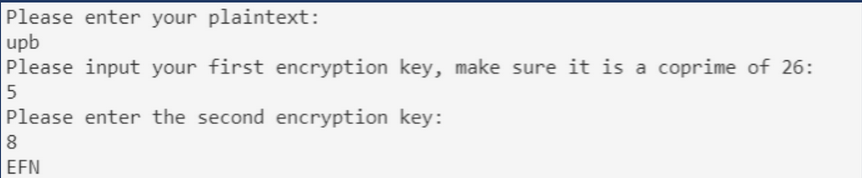

# tugaskripto2
# PERTEMUAN 7
# NAMA: RISKY HARIADI
# KELAS: TI. 20. A. 1
# NIM: 312010124

# 1. Mencoba membuat hasil output Affine 

Berikut hasil dari Encryption seperti diatas yang sudah saya lakukan.

Berikut hasil dari Decryption seperti diatas yang sudah saya lakukan.

# THANK'S FOR YOUR ATTENTION!! SEE YOU!!

